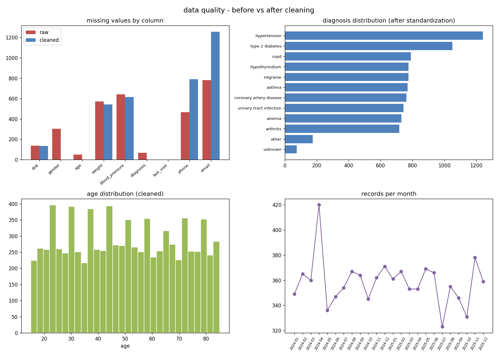

# NLP-based Healthcare Dataset Cleaning

This is a rework of an old college project of mine. The original version was a Flask app
with nltk, TF-IDF and KMeans thrown at the problem, which honestly was more complexity
than the task needed. I rebuilt it as a plain, readable data cleaning pipeline: one messy
raw EHR-style csv goes in, one clean analysis-ready csv comes out, plus a report and a
data quality chart. I kept the NLP part deliberately simple, just regex plus difflib,
since the goal is a clean dataset, not a language model.

The raw data is synthetic (generated with a seeded script, so everything is reproducible)
but the mess in it is modeled on the kind of garbage you actually see in exported clinic
records.

## the raw data mess

`data/raw_healthcare_data.csv` has 9,030 rows and all of this going on:

- three different date formats in the same columns: `12/03/2024`, `2024-03-12`, `12-Mar-2024`
- gender written as M / Male / male / m / F / female / f / unknown / U / blank
- blood pressure stored as text: `120/80`, `120 / 80`, `120/80 mmHg`, `n/a`
- weights with mixed units: `72 kg`, `72kg`, `159 lbs`, or just `72`
- diagnosis as free text with abbreviations and typos: `htn`, `high bp`, `T2DM`,
  `diabetess type II`, `migrane`, `C.O.P.D` and about 50 other spellings
- impossible ages: 999, -1, 150+
- 250 exact duplicate rows and 180 near-duplicates (same person registered twice with a
  new patient id and a typo in the name)
- phones in five formats, emails with stray spaces, uppercase, or missing domains
- random leading/trailing whitespace, including in the column headers themselves

## how the cleaning works

`src/clean_data.py` runs everything top to bottom:

1. load the raw csv and print a quick profile (shape, dtypes, missing counts)
2. standardize column names (strip, lowercase, underscores) and strip whitespace in every text cell
3. parse each date with an explicit regex per known format instead of throwing
   `errors='coerce'` at everything, so only genuinely broken values become null
4. normalize gender to M / F / Unknown
5. split blood pressure text into numeric `systolic_bp` and `diastolic_bp` columns
6. parse the unit out of the weight strings and convert everything to kg
7. null out impossible ages, then recompute age from date of birth where possible
8. normalize phone numbers to plain 10 digits and lowercase/validate emails
   (invalid values get nulled rather than kept wrong)
9. map the free-text diagnoses onto a 10-condition vocabulary (see below)
10. drop exact duplicate rows, then near-duplicates: same date of birth plus a fuzzy
    name match (`difflib.SequenceMatcher` ratio >= 0.85) means same patient
11. save `outputs/cleaned_healthcare_data.csv` and `outputs/cleaning_report.txt`

The original diagnosis text is kept in a `diagnosis_raw` column so you can audit what
got mapped to what.

## the light NLP part

Diagnosis mapping happens in three layers, cheapest first. First a regex cleanup
(lowercase, strip punctuation, squeeze whitespace) which already fixes things like
`C.O.P.D` and `Hypertension `. Second, a lookup in a small synonym dictionary I built by
eyeballing the raw values, which catches abbreviations like `htn` and `t2dm` that no
string similarity could guess. Third, `difflib.get_close_matches` from the standard
library as a fuzzy fallback for typos like `migrane` or `diabetess type ii`. Anything
that still doesn't match lands in an `other` bucket instead of being silently forced
into a wrong category.

## how to run

```
pip install -r requirements.txt
python data/make_raw_data.py        # generates the raw messy csv (seeded, reproducible)
python src/clean_data.py            # cleans it, writes csv + report to outputs/
python src/data_quality_charts.py   # writes outputs/data_quality.png
```

## before / after

| | raw | cleaned |
|---|---|---|
| rows | 9,030 | 8,601 |
| diagnosis spellings | 50+ | 10 conditions + other/unknown |
| date formats | 3 | 1 (ISO) |
| weight units | kg, lbs, bare numbers | kg only |

From the cleaning report: 250 exact duplicates and 179 near-duplicates removed,
2,544 weights converted from lbs, 8,389 blood pressure values split into numeric
columns, 75 impossible ages nulled (123 ages then recovered from date of birth),
364 invalid phones and 533 invalid emails nulled, 186 diagnoses left as `other`.

Note that the cleaned file has slightly more nulls than the raw one. That is on
purpose: an 8-digit phone number or an email without a domain is worse than a null,
so the pipeline nulls them instead of pretending they are fine.



## limitations

- the data is synthetic, so the mess is only as realistic as my generator. Real EHR
  exports are worse in ways I probably haven't thought of
- the synonym dictionary is hand-built for these 10 conditions. A new dataset would
  need that dictionary extended, which is manual work
- difflib with a 0.75 cutoff can in theory map a rare condition to a similar-looking
  common one. With a vocabulary this small it behaves well, but I wouldn't trust it
  blindly on hundreds of conditions
- the dedup rule (same DOB + fuzzy name) would merge actual twins-with-similar-names
  edge cases. Acceptable here, not in production
